# 1. Modern APP 파이어베이스 연동 익명 소셜 서비스 실습

<font color="gray" >실습 진행 및 문서작성: 안귀정(akj61300@gmail.com)</font>

실습으로 구현할 어플리케이션은 모씨와 비슷한 익명 소셜 서비스를 구현하는 것이다.


백엔드로 Firebase 를 이용하고, Support 라이브러리로 UI 를 구현합니다. 

<!--Crashlytics 로 이슈관리를 하는 것으로 실습을 마무리한다. -->

이 실습에서는 다음과 같은 내용을 다룬다.

* Design Support Library
* Material Design
* CardView
* RecyclerView
* Firebase

## 미리보기


# 2. 안드로이드 어플과 파이어베이스 연동 해보기(10 분)

## 2.1. 파이어베이스 가입 

### 2.1.1 파이어베이스 가입

[파이어베이스 홈페이지](https://www.firebase.com) 에서 SIGN UP WITH GOOGLE 버튼을 클릭하여 가입한다.

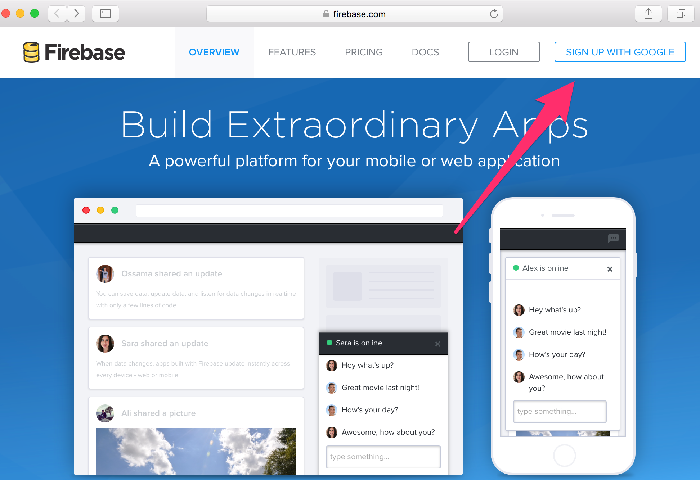

### 2.1.2. 파이어베이스 앱 생성

CREATE NEW APP 으로 파이어베이스 앱을 생성한다.

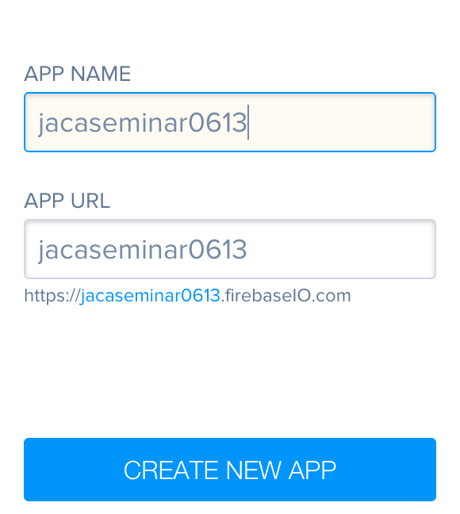

## 2.2. 안드로이드 프로젝트 생성

다음 절차에 따라 프로젝트를 생성한다.

* Start a New Android Studio 프로젝트 실행<br> 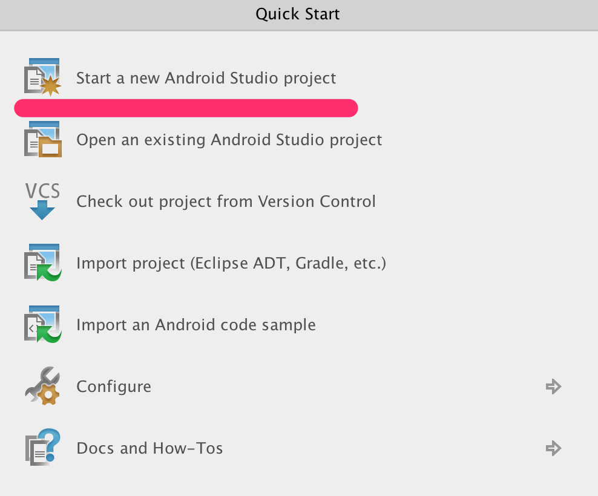
* 어플 이름, 회사 이름 지정. <br> 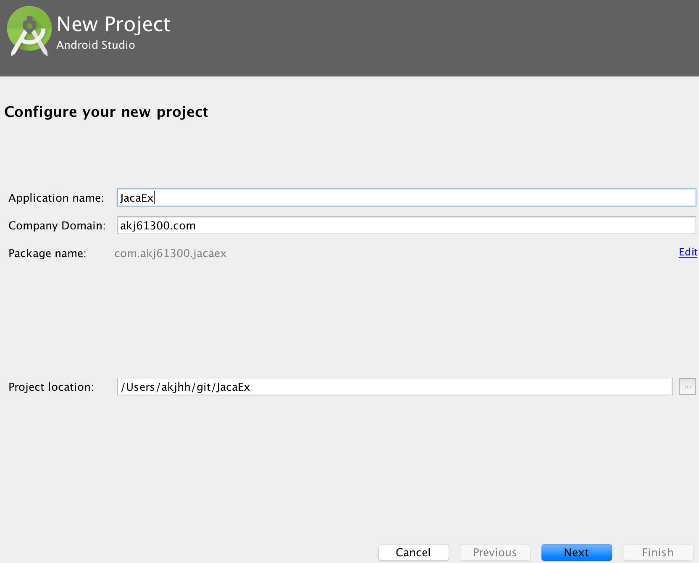
* 어플이 돌아갈 플랫폼, 최소 API 레벨 지정 <br> 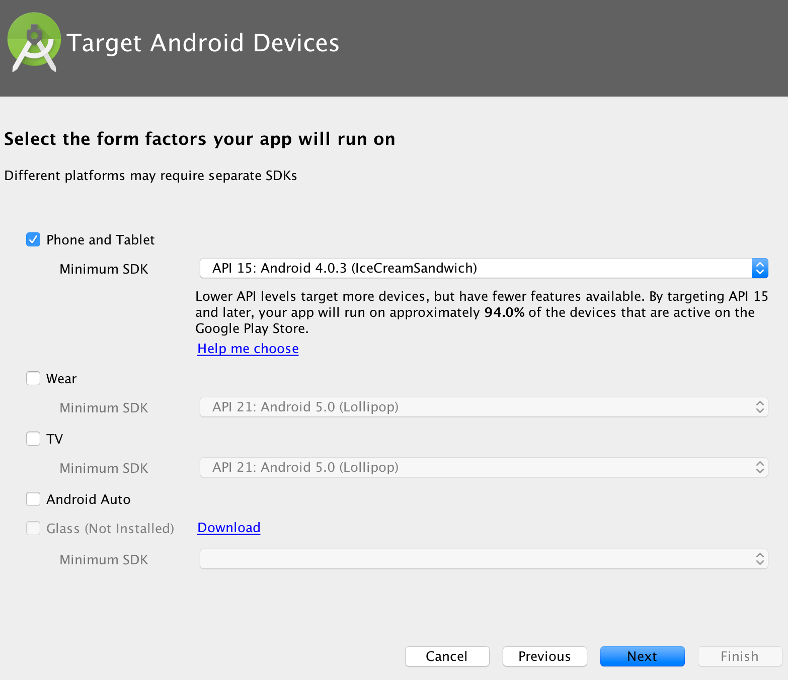
* 모바일 액티비티 타입에서 Blank Activity 타입 지정 <br>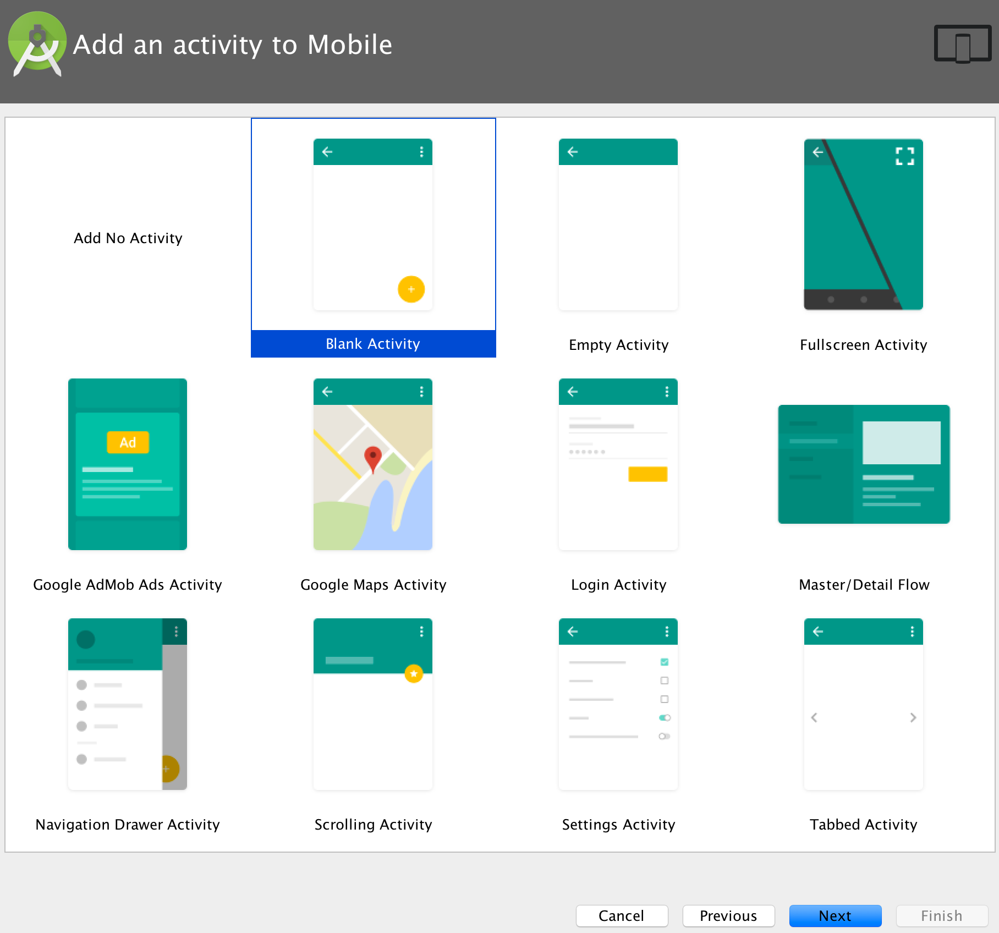
* 액티비티 이름 지정 후 완료 <br> 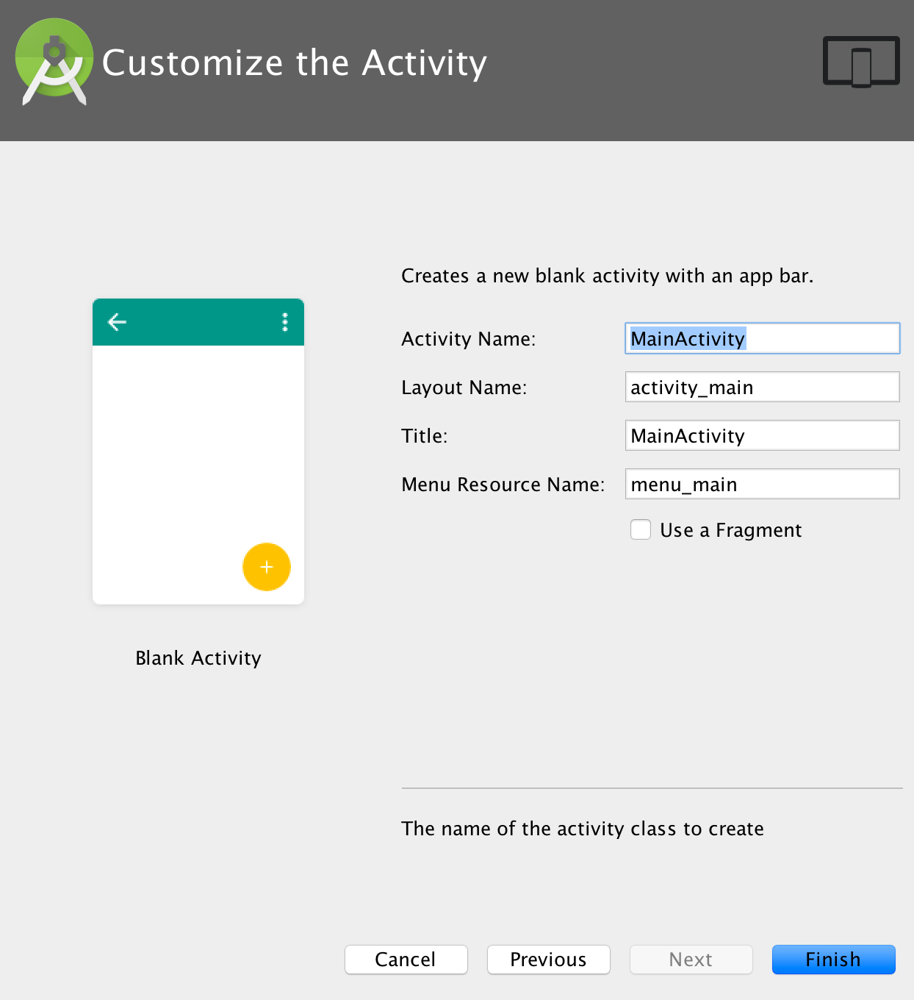


## 2.3. 안드로이드 파이어베이스 연동

다음 절차에 따라 Firebase 를 연동한다.

### 2.3.1. build.gradle 파일에 다음 코드 추가 firebase 라이브러리 의존성 추가

```gradle
dependencies {
    compile 'com.firebase:firebase-client-android:2.4.1+'
}
```

### 2.3.2. 라이센스 충돌을 피하기 위하여 build.gradle 에 다음 코드 추가

```gradle
android {
    ...
    packagingOptions {
        exclude 'META-INF/LICENSE'
        exclude 'META-INF/LICENSE-FIREBASE.txt'
        exclude 'META-INF/NOTICE'
    }
}
```

### 2.3.3. AndroidManifest.xml 에 Internet Permission 추가 

```xml
<uses-permission android:name="android.permission.INTERNET" />
```

### 2.3.4. MainActivity.java onCreate() 메소드에 다음 코드 추가

```java
@Override
public void onCreate() {
    super.onCreate();
    Firebase.setAndroidContext(this);
    // other setup code
}
```

## 2.4. 파이어베이스 연동 테스트

파이어 베이스와 안드로이드 어플이 정상적으로 연동이 되어 있는지 확인한다.

간단하게 확인만 하기 위하여 안드로이드 어플에 TextView 를 이용하여 Firebase 에 저장된 문자열을 보여준다. 

### 2.4.1. Firebase Manage 창에서 테스트 데이터 추가

* Firebase 대시보드에서 MANAGE 버튼 클릭 <br>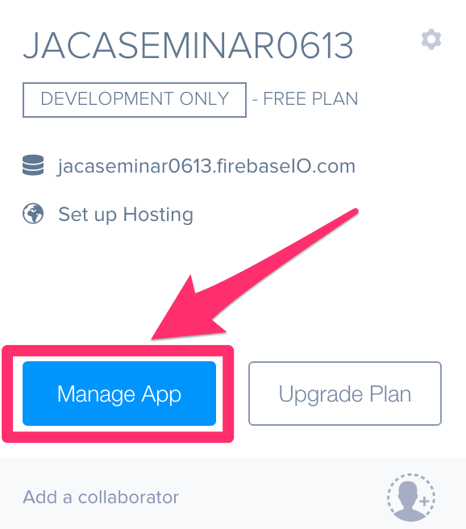

* "Test" 를 키로 하고 "이번 오픈세미나 짱짱!" 을 데이터로 하는 문자열 데이터 추가 <br>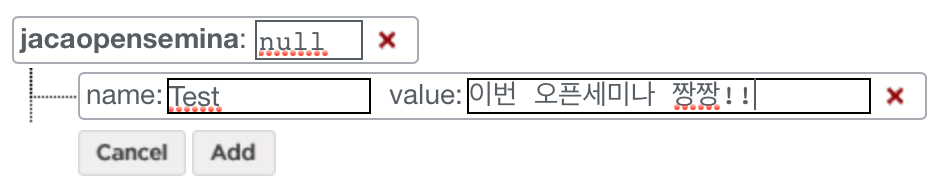 <br><br>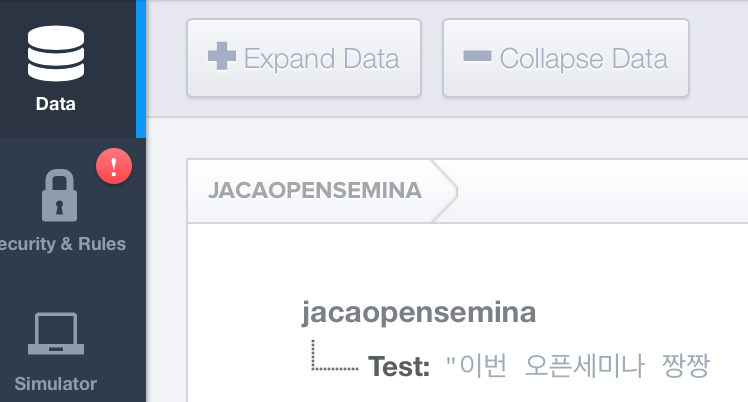 


### 2.4.2. content_main.xml 에서 TextView id 지정

``` java
<TextView
        android:id="@+id/helloText"
        android:text="Hello World!"
        android:layout_width="wrap_content"
        android:layout_height="wrap_content"/>
```

### 2.4.3. MainActivity.java 파일에서 다음 코드 추가

```java
public class MainActivity extends AppCompatActivity {

    @Override
    protected void onCreate(Bundle savedInstanceState) {
  		// ... previous code 
  		
    	final TextView helloText = (TextView) findViewById(R.id.helloText);
		// URL 로 심플하게 스키마에 접근 가능
        Firebase ref = new Firebase("https://jacaopensemina.firebaseIO.com/Test");
        // Get a reference to our posts
        // Attach an listener to read the data at our posts reference
        ref.addValueEventListener(new ValueEventListener() {
            @Override
            public void onDataChange(DataSnapshot snapshot) {
                helloText.setText(snapshot.getValue().toString());
            }

            @Override
            public void onCancelled(FirebaseError firebaseError) {
                System.out.println("The read failed: " + firebaseError.getMessage());
            }
        });
    }
```

## 2.5. 결과 화면 확인

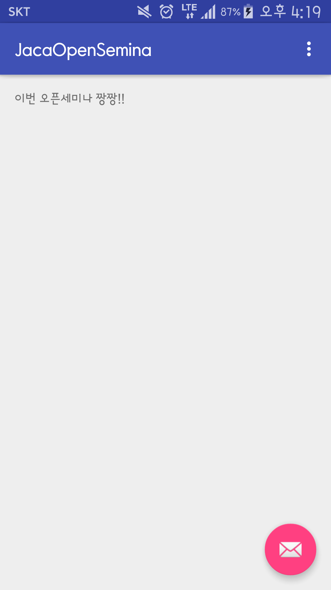 

## 2.6. Firebase 리얼타임으로 데이터 변경 적용되는 것 확인 

* 파이어베이스 관리 화면에서 Test 의 데이터를 "오늘 실습 잘.됐.으.면. 좋겠네!" 로 변경 <br>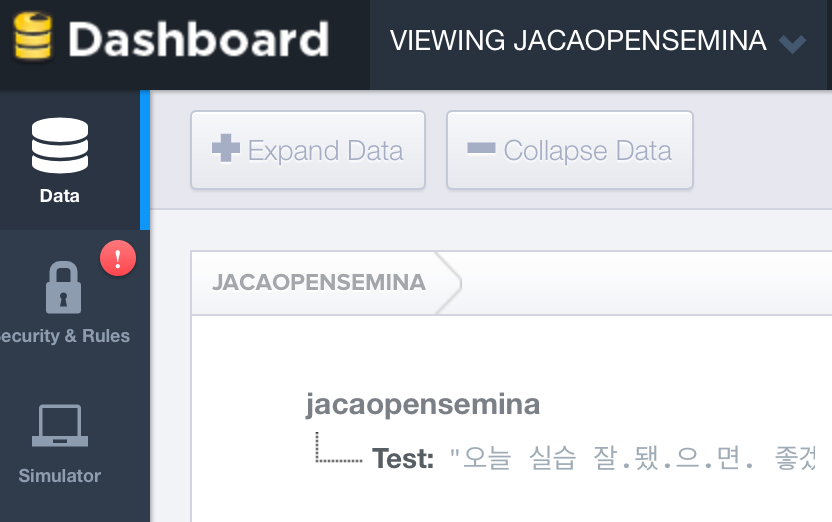 
* 폰에서 실시간으로 화면이 갱신되는 것 확인 <br>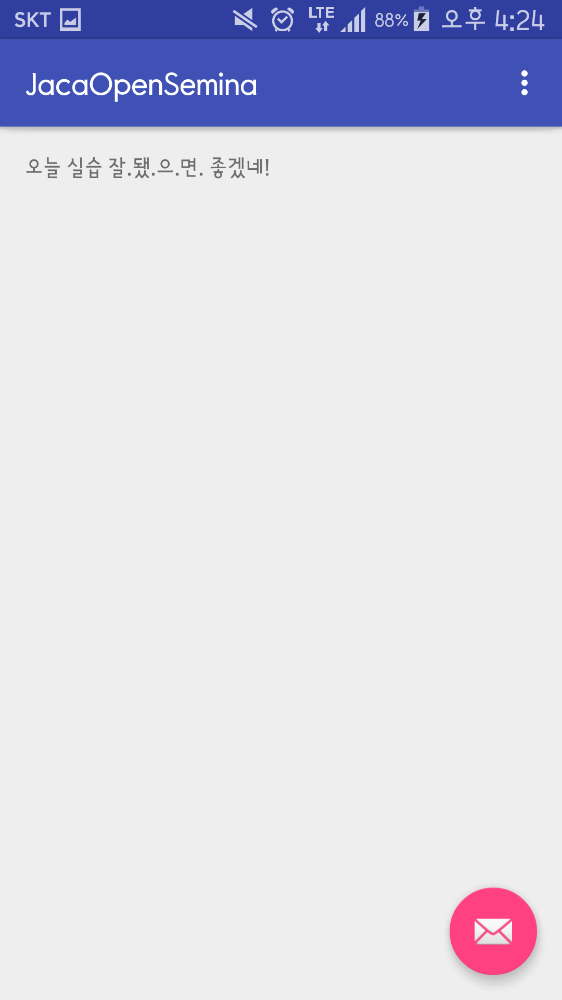 

# 3. CardView, RecyclerView 를 이용하여 소셜 UI 제작(20분) 

## 3.1. PostActivity 생성 및 런쳐 액티비티 변경 

* 기존 실습 샘플을 유지하면서 새로운 실습을 하기위해 PostActivity 를 새로 생성한다. New --> Activity --> Blank Activity <br><br>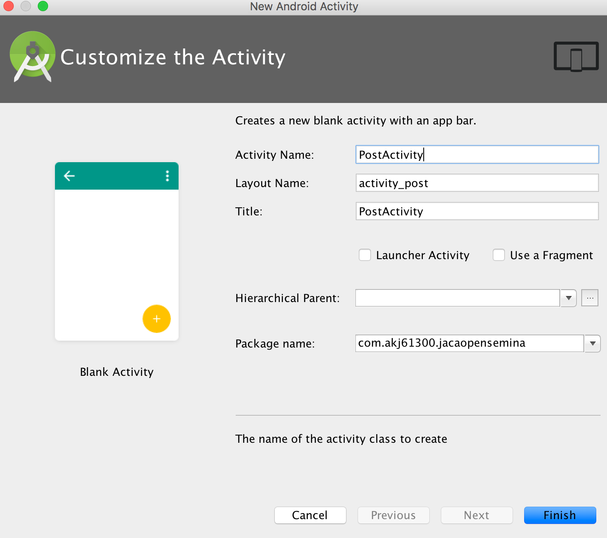

* AndroidManifest.xml 파일에서 LuncherIntent 를 받는 Activity 를 변경한다. 

AndroidManifest.xml

```xml
...
<activity
    android:name=".MainActivity"
    android:label="@string/app_name"
    android:theme="@style/AppTheme.NoActionBar">
</activity>
<activity
    android:name=".PostActivity"
    android:label="@string/title_activity_post"
    android:theme="@style/AppTheme.NoActionBar">
    <intent-filter>
        <action android:name="android.intent.action.MAIN"/>
        <category android:name="android.intent.category.LAUNCHER"/>
    </intent-filter>
</activity>
...

```

## 3.2. 앱에서 사용할 Comment, Post 도메인 클래스 생성

Comment.java

```java
// 포스트의 댓글
public class Comment {
    String writerId;
    String text;
    String bgUrl;
    long writeTime;

    public String getWriterId() {
        return writerId;
    }

    public void setWriterId(String writerId) {
        this.writerId = writerId;
    }

    public String getText() {
        return text;
    }

    public void setText(String text) {
        this.text = text;
    }

    public String getBgUrl() {
        return bgUrl;
    }

    public void setBgUrl(String bgUrl) {
        this.bgUrl = bgUrl;
    }

    public long getWriteTime() {
        return writeTime;
    }

    public void setWriteTime(long writeTime) {
        this.writeTime = writeTime;
    }
}
```

Post.java

```java
// 블로깅 포스트의 도메인 클래스
public class Post {
    String writerId;
    String text;
    String bgUrl;
    long writeTime;
    Map<String, Comment> commentMap = new HashMap<>();


    public String getWriterId() {
        return writerId;
    }

    public void setWriterId(String writerId) {
        this.writerId = writerId;
    }

    public String getText() {
        return text;
    }

    public void setText(String text) {
        this.text = text;
    }

    public String getBgUrl() {
        return bgUrl;
    }

    public void setBgUrl(String bgUrl) {
        this.bgUrl = bgUrl;
    }

    public long getWriteTime() {
        return writeTime;
    }

    public void setWriteTime(long writeTime) {
        this.writeTime = writeTime;
    }

    public Map<String, Comment> getCommentMap() {
        return commentMap;
    }

    public void setCommentMap(Map<String, Comment> commentMap) {
        this.commentMap = commentMap;
    }
}
```

## 3.3. CardView, RecyclerView, AutoFitTextView 라이브러리 의존성 추가 및 largeHeap 설정

### 3.3.1 라이브러리 의존성 추가 

/app/build.gradle

```gradle
dependencies {
	...
    compile 'com.android.support:cardview-v7:23.1.1'
    compile 'com.android.support:recyclerview-v7:23.1.1'
    compile 'me.grantland:autofittextview:0.2.+'
    compile 'com.github.bumptech.glide:glide:3.6.1'
    compile 'net.danlew:android.joda:2.9.0'
    compile 'com.google.code.gson:gson:2.5'
}
```

|라이브러리|설명|
|:--|:--|
|com.android.support:cardview-v7|Material Design 에 카드뷰를 안드로이드 롤리팝 미만 하위버전에서도 적용시켜주는 서포트 라이브러리|
|com.android.support:recyclerview-v7|RecyclerView 를 하위버전에서도 사용가능하게 하는 서포트라이브러리|
|me.grantland:autofittextview|텍스트뷰 영역에 따라 텍스트 글씨 크기를 자동으로 조정해주는 라이브러리|
|com.github.bumptech.glide:glide|이미지 다운로드 및 캐시를 제공하고 안드로이드서 네트워크 이미지 사용을 편하게 해주는 라이브러리|
|net.danlew:android.joda|Date Time 관련하여 보다 편리하게 사용하기 위하여 추가|
|com.google.code.gson:gson|JSON 형태의 데이터를 자바 객체로 변경을 쉽게 도와주는 라이브러리|

### 3.3.2. AndroidManifest.xml 에 largeHeap 설정 추가

```xml
 <application
        android:largeHeap="true"
        android:allowBackup="true"
        android:icon="@mipmap/ic_launcher"
        android:label="@string/app_name"
        android:supportsRtl="true"
        android:theme="@style/AppTheme">
```

## 3.4. 어플에서 사용할 이미지 리소스 추가

### 3.4.1. 카드 기본 이미지


### 3.4.2. 카드가 작성된 시간 아이콘


### 3.4.3. 댓글 아이콘


## 3.5. Card 레이아웃 작성

포스팅을 보여줄 카드의 레이아웃을 작성한다. 

/app/src/main/java/res/card_post.xml

```xml
<?xml version="1.0" encoding="utf-8"?>
<android.support.v7.widget.CardView
    android:id="@+id/card_view"
    xmlns:android="http://schemas.android.com/apk/res/android"
    xmlns:card_view="http://schemas.android.com/apk/res-auto"
    android:layout_width="match_parent"
    android:layout_height="220dp"
    android:clickable="true"
    android:foreground="?android:attr/selectableItemBackground"
    card_view:cardBackgroundColor="@android:color/white"
    card_view:cardCornerRadius="4dp"
    card_view:cardUseCompatPadding="true">

    <ImageView
        android:id="@+id/background"
        android:layout_width="match_parent"
        android:layout_height="220dp"
        android:scaleType="centerCrop"
        android:src="@drawable/default_bg"/>

    <RelativeLayout
        android:layout_width="match_parent"
        android:layout_height="match_parent">

        <me.grantland.widget.AutofitTextView
            android:id="@+id/text"
            android:layout_width="wrap_content"
            android:layout_height="wrap_content"
            android:layout_centerInParent="true"
            android:layout_margin="8dp"
            android:background="#66000000"
            android:gravity="center"
            android:maxLines="3"
            android:text="아 배고프다"
            android:textColor="@android:color/white"
            android:textSize="24sp"/>

        <RelativeLayout
            android:layout_width="match_parent"
            android:layout_height="wrap_content"
            android:layout_alignParentBottom="true"
            android:background="#88000000"
            android:padding="4dp">

            <ImageView
                android:id="@+id/clockImageView"
                android:layout_width="wrap_content"
                android:layout_height="wrap_content"
                android:scaleType="fitXY"
                android:src="@drawable/clock"/>

            <TextView
                android:id="@+id/timeText"
                android:layout_width="wrap_content"
                android:layout_height="wrap_content"
                android:layout_alignBottom="@+id/clockImageView"
                android:layout_alignTop="@id/clockImageView"
                android:layout_marginLeft="4dp"
                android:layout_toRightOf="@+id/clockImageView"
                android:gravity="center"
                android:singleLine="true"
                android:text="40분전"
                android:textColor="@android:color/white"/>

            <TextView
                android:id="@+id/commentCount"
                android:layout_width="wrap_content"
                android:layout_height="wrap_content"
                android:layout_alignBottom="@id/clockImageView"
                android:layout_alignParentRight="true"
                android:layout_alignTop="@+id/clockImageView"
                android:layout_marginRight="4dp"
                android:gravity="center_vertical"
                android:text="41"
                android:textColor="@android:color/white"/>

            <ImageView
                android:layout_width="wrap_content"
                android:layout_height="wrap_content"
                android:layout_alignBottom="@id/clockImageView"
                android:layout_alignTop="@+id/clockImageView"
                android:layout_toLeftOf="@+id/commentCount"
                android:adjustViewBounds="true"
                android:padding="2dp"
                android:src="@drawable/chat"/>
        </RelativeLayout>
    </RelativeLayout>
</android.support.v7.widget.CardView>
```

프리뷰 화면에서 다음과 같은 모습이된다.

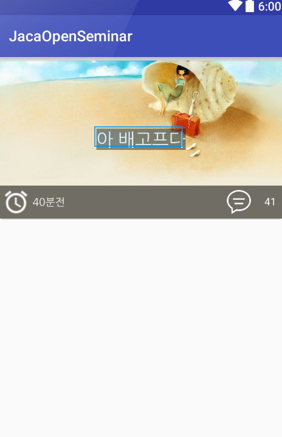


## 3.6. PostActivity 레이아웃 작성

content_post.xml 

```xml
<?xml version="1.0" encoding="utf-8"?>
<RelativeLayout
    xmlns:android="http://schemas.android.com/apk/res/android"
    xmlns:tools="http://schemas.android.com/tools"
    xmlns:app="http://schemas.android.com/apk/res-auto"
    android:layout_width="match_parent"
    android:layout_height="match_parent"
    app:layout_behavior="@string/appbar_scrolling_view_behavior"
    tools:showIn="@layout/activity_post"
    tools:context="com.akj61300.jacaopensemina.PostActivity">

    <android.support.v7.widget.RecyclerView
        android:id="@+id/recyclerView"
        android:layout_width="match_parent"
        android:layout_height="match_parent">
    </android.support.v7.widget.RecyclerView>

</RelativeLayout>
```

## 3.7. PostActivity 자바코드 작성

PostActivity.java

```java
public class PostActivity extends AppCompatActivity {
    public static final String FIREBASE_POST_URL = "https://jacaseminar0613.firebaseio.com/Posts";
    private RecyclerView mRecyclerView;
    private LinearLayoutManager mLinearLayoutManager;
    private MyAdapter mAdapter;
    private List<Post> mPosts = new ArrayList<>();
    private List<String> mKeys = new ArrayList<>();
    private Query mRef;

    @Override
    protected void onCreate(Bundle savedInstanceState) {
        super.onCreate(savedInstanceState);
        Firebase.setAndroidContext(this);
        JodaTimeAndroid.init(this);
        setContentView(R.layout.activity_post);
        Toolbar toolbar = (Toolbar) findViewById(R.id.toolbar);
        mRecyclerView = (RecyclerView) findViewById(R.id.recyclerView);
        setSupportActionBar(toolbar);

        mLinearLayoutManager = new LinearLayoutManager(this);

        // 데이터의 순서를 역순으로 보여줌
        mLinearLayoutManager.setReverseLayout(true);
        mLinearLayoutManager.setStackFromEnd(true);

        mRecyclerView.setLayoutManager(mLinearLayoutManager);
        mAdapter = new MyAdapter();
        mRecyclerView.setAdapter(mAdapter);

        FloatingActionButton fab = (FloatingActionButton) findViewById(R.id.fab);
        fab.setOnClickListener(new View.OnClickListener() {
            @Override
            public void onClick(View view) {
                Snackbar.make(view, "Replace with your own action", Snackbar.LENGTH_LONG)
                        .setAction("Action", null).show();
            }
        });

        // Firebase 연동 후 Child Event Listener 등록
        mRef = new Firebase(FIREBASE_POST_URL).orderByChild("writeTime");
        mRef.addChildEventListener(new ChildEventListener() {
            @Override
            public void onChildAdded(DataSnapshot dataSnapshot, String previousChildName) {
                Post value = dataSnapshot.getValue(Post.class);
                String key = dataSnapshot.getKey();
                if (previousChildName == null) {
                    mPosts.add(0, value);
                    mKeys.add(0, key);
                } else {
                    int previousIndex = mKeys.indexOf(previousChildName);
                    int nextIndex = previousIndex + 1;
                    if (nextIndex == mPosts.size()) {
                        mPosts.add(value);
                        mKeys.add(key);
                    } else {
                        mPosts.add(nextIndex, value);
                        mKeys.add(nextIndex, key);
                    }
                }
                mAdapter.notifyDataSetChanged();
            }

            @Override
            public void onChildChanged(DataSnapshot dataSnapshot, String s) {
                String key = dataSnapshot.getKey();
                Post value = dataSnapshot.getValue(Post.class);
                int index = mKeys.indexOf(key);
                mPosts.set(index, value);

                mAdapter.notifyDataSetChanged();
            }

            @Override
            public void onChildRemoved(DataSnapshot dataSnapshot) {
                // A model was removed from the list. Remove it from our list and the name mapping
                String key = dataSnapshot.getKey();
                int index = mKeys.indexOf(key);

                mKeys.remove(index);
                mPosts.remove(index);

                mAdapter.notifyDataSetChanged();
            }

            @Override
            public void onChildMoved(DataSnapshot dataSnapshot, String previousChildName) {
                // A model changed position in the list. Update our list accordingly
                String key = dataSnapshot.getKey();
                Post newModel = dataSnapshot.getValue(Post.class);
                int index = mKeys.indexOf(key);
                mPosts.remove(index);
                mKeys.remove(index);
                if (previousChildName == null) {
                    mPosts.add(0, newModel);
                    mKeys.add(0, key);
                } else {
                    int previousIndex = mKeys.indexOf(previousChildName);
                    int nextIndex = previousIndex + 1;
                    if (nextIndex == mPosts.size()) {
                        mPosts.add(newModel);
                        mKeys.add(key);
                    } else {
                        mPosts.add(nextIndex, newModel);
                        mKeys.add(nextIndex, key);
                    }
                }
                mAdapter.notifyDataSetChanged();
            }

            @Override
            public void onCancelled(FirebaseError firebaseError) {
                firebaseError.toException().printStackTrace();
            }
        });
    }

    class MyViewHolder extends RecyclerView.ViewHolder {
        TextView text;
        ImageView background;
        TextView timeText;
        TextView commentCount;
        CardView cardView;

        public MyViewHolder(View itemView) {
            super(itemView);
            text = (TextView) itemView.findViewById(R.id.text);
            background = (ImageView) itemView.findViewById(R.id.background);
            timeText = (TextView) itemView.findViewById(R.id.timeText);
            commentCount = (TextView) itemView.findViewById(R.id.commentCount);
            cardView = (CardView) itemView.findViewById(R.id.card_view);
        }
    }

    class MyAdapter extends RecyclerView.Adapter<MyViewHolder> {

        @Override
        public MyViewHolder onCreateViewHolder(ViewGroup parent, int viewType) {
            View itemView = getLayoutInflater().inflate(R.layout.card_post, null);
            MyViewHolder myViewHolder = new MyViewHolder(itemView);
            return myViewHolder;
        }

        @Override
        public void onBindViewHolder(MyViewHolder holder, int position) {
            Post post = mPosts.get(position);
            holder.text.setText(post.getText());
            holder.commentCount.setText("" + post.getCommentMap().size());
            holder.timeText.setText(getDiffTimeText(post.getWriteTime()));
            Glide.with(PostActivity.this).load(post.getBgUrl()).centerCrop().into(holder.background);
        }

        @Override
        public int getItemCount() {
            return mPosts.size();
        }
    }

    String getDiffTimeText(long targetTime) {
        DateTime curDateTime = new DateTime();
        DateTime targetDateTime = new DateTime().withMillis(targetTime);

        int diffDay = Days.daysBetween(curDateTime, targetDateTime).getDays();
        int diffHours = Hours.hoursBetween(targetDateTime, curDateTime).getHours();
        int diffMinutes = Minutes.minutesBetween(targetDateTime, curDateTime).getMinutes();
        if (diffDay == 0) {
            if(diffHours == 0 && diffMinutes == 0){
                return "방금전";
            }
            if(diffHours > 0){
                return "" + diffHours + "시간 전";
            }
            return "" + diffMinutes + "분 전";

        } else {
            SimpleDateFormat format = new SimpleDateFormat("yyyy-MM-dd HH:mm");
            return format.format(new Date(targetTime));
        }
    }
}
```

## 3.8. Firebase 에 샘플 데이터 import

아래 json 데이터를 파일로 저장하고 Firebase 에 import 한다.

```json
{
	"Posts" : {
		"sample01" : {
			"writerId" : "user01",
			"text": "내가 제일 잘나가",
			"writeTime" :  1448587380000,
			"bgUrl" : "http://postfiles1.naver.net/20151124_256/akj61300_1448357467095Vrg0b_JPEG/bg1.jpg?type=w2"
		},
		"sample02" : {
			"writerId" : "user01",
			"text": "서울 30세 흔남이고 수영 좋아합니다. 질문받습니다.",
			"writeTime" :  1448587480000,
			"bgUrl" : "http://postfiles3.naver.net/20151124_34/akj61300_1448357467313uh0x1_JPEG/bg2.jpg?type=w2"
		},
		"sample03" : {
			"writerId" : "user01",
			"text": "로또좀 당첨됐음 좋겠네...",
			"writeTime" :  1448587680000,
			"bgUrl" : "http://postfiles2.naver.net/20151124_97/akj61300_1448357467420bK7gG_JPEG/bg3.jpg?type=w2"
		},
		"sample04" : {
			"writerId" : "user01",
			"text": "금수저 흙수저",
			"writeTime" :  1448588380000,
			"bgUrl" : "http://postfiles14.naver.net/20151124_45/akj61300_14483574677262F7Mv_PNG/bg4.png?type=w2"
		},
		"sample05" : {
			"writerId" : "user01",
			"text": "나으 존재 화이팅",
			"writeTime" :  1448589380000,
			"bgUrl" : "http://postfiles13.naver.net/20151124_60/akj61300_14483574681851taaJ_JPEG/bg7.jpg?type=w2"
		},
		"sample06" : {
			"writerId" : "user01",
			"text": "노오력이 필요하다",
			"writeTime" :  1448599380000,
			"bgUrl" : "http://postfiles12.naver.net/20151124_75/akj61300_1448357468623icjWS_JPEG/bg10.jpg?type=w2"
		}
	}
}
```

## 3.9. 결과 확인

화면이 다음과 같이 나오면 성공이다.

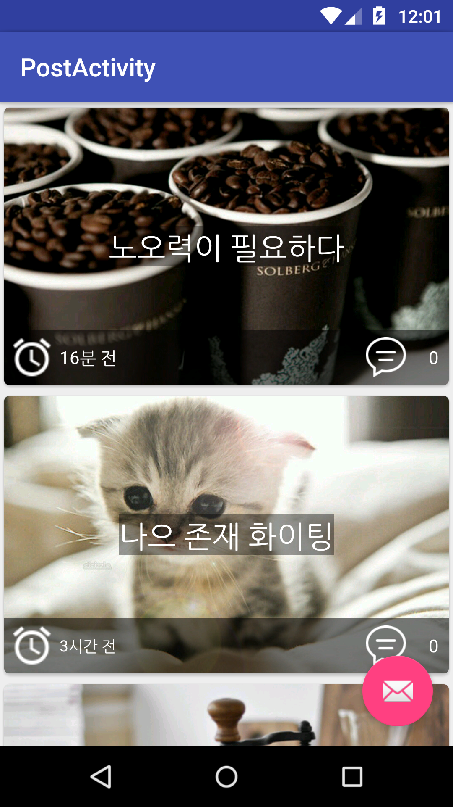


# 4. 글쓰기 기능 작성(10분)

## 4.1. 카드 배경 이미지 Resource Firebase 에 추가

다음 json 데이터를 파일로 저장하여 assets 디렉토리에 bg_urls.json 으로 저장한다.

```json
[
	"http://postfiles1.naver.net/20151124_256/akj61300_1448357467095Vrg0b_JPEG/bg1.jpg?type=w2",
	"http://postfiles3.naver.net/20151124_34/akj61300_1448357467313uh0x1_JPEG/bg2.jpg?type=w2",
	"http://postfiles2.naver.net/20151124_97/akj61300_1448357467420bK7gG_JPEG/bg3.jpg?type=w2",
	"http://postfiles14.naver.net/20151124_45/akj61300_14483574677262F7Mv_PNG/bg4.png?type=w2",
	"http://postfiles6.naver.net/20151124_229/akj61300_14483574679065XGVq_JPEG/bg6.jpg?type=w2",
	"http://postfiles13.naver.net/20151124_60/akj61300_14483574681851taaJ_JPEG/bg7.jpg?type=w2",
	"http://postfiles13.naver.net/20151124_92/akj61300_1448357468313HoLXs_JPEG/bg8.jpg?type=w2",
	"http://postfiles2.naver.net/20151124_129/akj61300_14483574684982jiXs_JPEG/bg9.jpg?type=w2",
	"http://postfiles12.naver.net/20151124_75/akj61300_1448357468623icjWS_JPEG/bg10.jpg?type=w2"
]
```

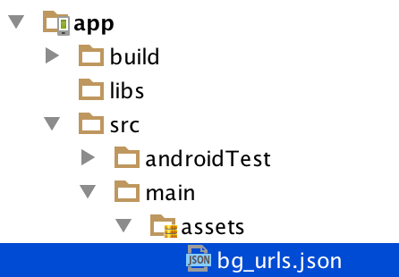

## 4.2. 글쓰기로 사용할 WriteActivity 생성

PostActivity 생성 때와 마찬가지로 WriteActivity 를 생성한다.


## 4.3. PostActivity 버튼에 WriteActivity 연결 

PostActivity.java 부분에 다음 코드 추가

```java
public class PostActivity extends AppCompatActivity {
	...
    private static final int REQUEST_WRITE = 0;
    ...
    @Override
    protected void onCreate(Bundle savedInstanceState) {
    ...
    	FloatingActionButton fab = (FloatingActionButton) findViewById(R.id.fab);
        fab.setOnClickListener(new View.OnClickListener() {
            @Override
            public void onClick(View view) {
                Intent intent = new Intent(PostActivity.this, WriteActivity.class);
                startActivityForResult(intent, REQUEST_WRITE);
            }
        });

```

## 4.4. WriteActivity 레이아웃 작성

content_write.xml 파일을 다음과 같이 편집한다.

```xml
<?xml version="1.0" encoding="utf-8"?>
<RelativeLayout
    xmlns:android="http://schemas.android.com/apk/res/android"
    xmlns:app="http://schemas.android.com/apk/res-auto"
    xmlns:tools="http://schemas.android.com/tools"
    android:layout_width="match_parent"
    android:layout_height="match_parent"
    android:paddingBottom="@dimen/activity_vertical_margin"
    android:paddingLeft="@dimen/activity_horizontal_margin"
    android:paddingRight="@dimen/activity_horizontal_margin"
    android:paddingTop="@dimen/activity_vertical_margin"
    app:layout_behavior="@string/appbar_scrolling_view_behavior"
    tools:context="com.akj61300.jacaopenseminar.WriteActivity"
    tools:showIn="@layout/activity_write">

    <RelativeLayout
        android:id="@+id/inputLayout"
        android:layout_width="match_parent"
        android:layout_height="250dp">

        <ImageView
            android:id="@+id/writeBackground"
            android:src="@drawable/default_bg"
            android:layout_width="match_parent"
            android:layout_height="match_parent"/>

        <EditText
            android:background="#aa000000"
            android:textColor="@android:color/white"
            android:hint="따듯한 글을 써주세요"
            android:textColorHint="#cccccc"
            android:id="@+id/input"
            android:gravity="top"
            android:padding="2dp"
            android:layout_width="match_parent"
            android:layout_height="match_parent"
            android:inputType="textMultiLine"/>
    </RelativeLayout>

    <android.support.v7.widget.RecyclerView
        android:id="@+id/recyclerView"
        android:layout_width="match_parent"
        android:layout_height="100dp"
        android:layout_below="@+id/inputLayout"
        />

</RelativeLayout>
```

## 4.5. card_image.xml 작성 

카드의 배경 이미지를 선택할 리스트를 보여주기 위하여 card_image.xml 을 작성한다.


```xml
<?xml version="1.0" encoding="utf-8"?>
<android.support.v7.widget.CardView
    android:id="@+id/card_view"
    xmlns:android="http://schemas.android.com/apk/res/android"
    xmlns:card_view="http://schemas.android.com/apk/res-auto"
    android:layout_width="100dp"
    android:layout_height="100dp"
    android:clickable="true"
    card_view:cardBackgroundColor="@android:color/white"
    card_view:cardCornerRadius="4dp"
    card_view:cardUseCompatPadding="true">

    <ImageView
        android:id="@+id/background"
        android:layout_width="100dp"
        android:layout_height="100dp"
        android:scaleType="centerCrop"
        android:src="@drawable/default_bg"/>

</android.support.v7.widget.CardView>
```

## 4.6. WriteActivity 코드 작성

```java
public class WriteActivity extends AppCompatActivity {
    private EditText mInput;
    private LinearLayoutManager mLinearLayoutManager;
    private RecyclerView mRecyclerView;
    private List<String> bgUrls = new ArrayList<>();
    private final String DEFAULT_BG_URL = "http://postfiles1.naver.net/20151124_256/akj61300_1448357467095Vrg0b_JPEG/bg1.jpg?type=w2";
    private ImageView mWriteBackground;
    private int mCardBgPosition = 0;

    @Override
    protected void onCreate(Bundle savedInstanceState) {
        super.onCreate(savedInstanceState);
        setContentView(R.layout.activity_write);
        Toolbar toolbar = (Toolbar) findViewById(R.id.toolbar);
        setSupportActionBar(toolbar);

        // assets 에 json 에서 배경이미지 목록을 불러옴
        try {
            InputStream stream = getAssets().open("bg_urls.json");
            String[] bgArray = new Gson().fromJson(new InputStreamReader(stream), String[].class);
            if (bgArray != null && bgArray.length > 0) {
                bgUrls.addAll(Arrays.asList(bgArray));
            }
            if (bgUrls.isEmpty()) {
                bgUrls.add(DEFAULT_BG_URL);
            }
        } catch (IOException e) {
            e.printStackTrace();
        }
        mInput = (EditText) findViewById(R.id.input);
        mWriteBackground = (ImageView) findViewById(R.id.writeBackground);
        mRecyclerView = (RecyclerView) findViewById(R.id.recyclerView);
        mLinearLayoutManager = new LinearLayoutManager(this);
        mLinearLayoutManager.setOrientation(LinearLayoutManager.HORIZONTAL);
        mRecyclerView.setLayoutManager(mLinearLayoutManager);
        mRecyclerView.setAdapter(new MyImageAdapter());

        FloatingActionButton fab = (FloatingActionButton) findViewById(R.id.fab);
        fab.setOnClickListener(new View.OnClickListener() {
            @Override
            public void onClick(View view) {
                String text = mInput.getText().toString();
                if(TextUtils.isEmpty(text)){
                    return;
                }
                Post post = new Post();
                post.setText(text);
                post.setBgUrl(bgUrls.get(mCardBgPosition));
                post.setWriterId(getMyId());
                post.setWriteTime(System.currentTimeMillis());

                new Firebase(PostActivity.FIREBASE_POST_URL).push().setValue(post);
                setResult(RESULT_OK);
                finish();
            }
        });
    }

    class MyImageAdapter extends RecyclerView.Adapter<MyImageViewHolder> {

        @Override
        public MyImageViewHolder onCreateViewHolder(ViewGroup parent, int viewType) {
            View itemView = getLayoutInflater().inflate(R.layout.card_image, null);
            MyImageViewHolder myImageViewHolder = new MyImageViewHolder(itemView);
            return myImageViewHolder;
        }

        @Override
        public void onBindViewHolder(MyImageViewHolder holder, final int position) {
            final String imgSrc = bgUrls.get(position);
            Glide.with(WriteActivity.this).load(imgSrc).centerCrop().into(holder.background);
            holder.background.setOnClickListener(new View.OnClickListener() {
                @Override
                public void onClick(View v) {
                    Glide.with(WriteActivity.this).load(imgSrc).centerCrop().into(mWriteBackground);
                    mCardBgPosition = position;
                }
            });
        }

        @Override
        public int getItemCount() {
            return bgUrls.size();
        }
    }

    class MyImageViewHolder extends RecyclerView.ViewHolder {
        ImageView background;

        public MyImageViewHolder(View itemView) {
            super(itemView);
            background = (ImageView) itemView.findViewById(R.id.background);
        }
    }

    private String getMyId(){
        return Settings.Secure.getString(this.getContentResolver(),
                Settings.Secure.ANDROID_ID);
    }
}
```

## 4.7. Write 기능 확인

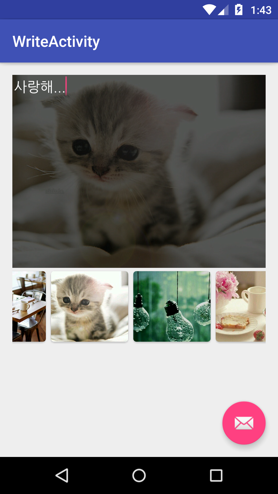
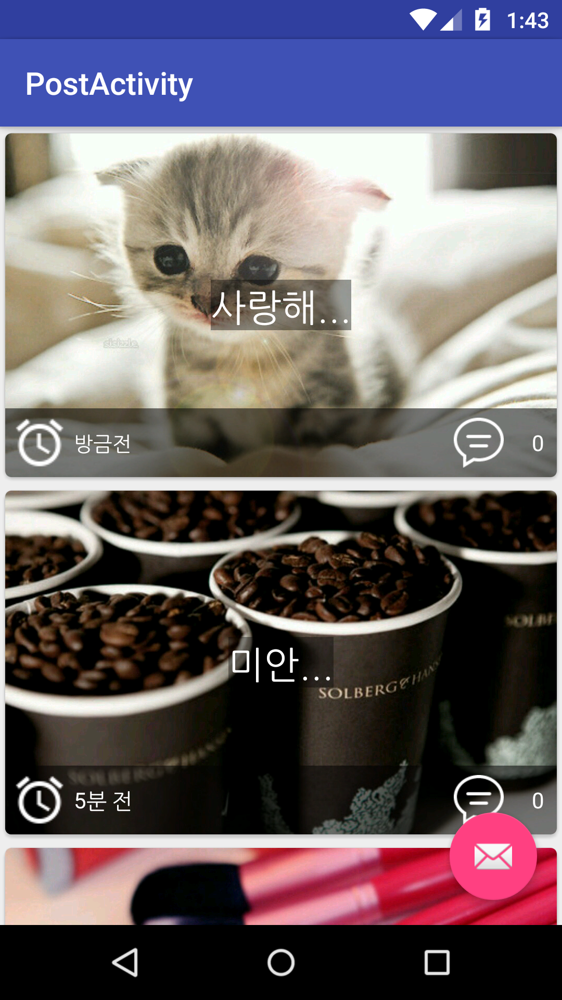


# 5. 카드보기 및 댓글보기 작성(10분)

카드를 클릭한 경우 카드와 댓글을 보여주는 기능을 만드는 부분입니다. 


## 5.1. DetailActivity 생성 

앞서 Activity 를 생성한것과 마찬가지로 DetailActivity 를 생성한다.

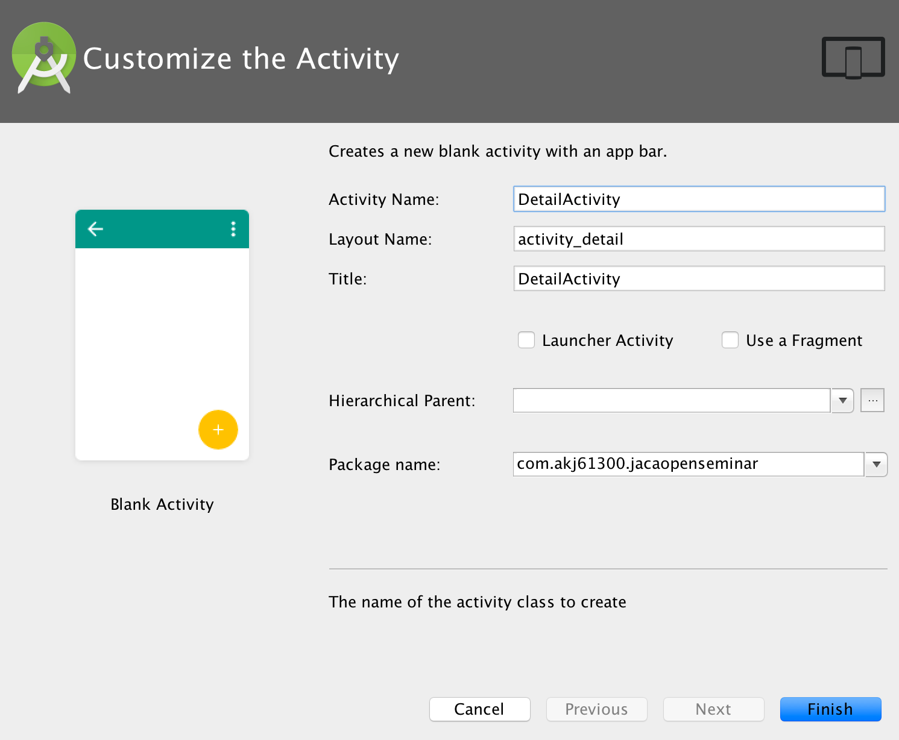

## 5.2. DetailActivity 레이아웃 작성

content_detail.xml

```xml
<?xml version="1.0" encoding="utf-8"?>
<RelativeLayout
    xmlns:android="http://schemas.android.com/apk/res/android"
    xmlns:app="http://schemas.android.com/apk/res-auto"
    xmlns:tools="http://schemas.android.com/tools"
    android:layout_width="match_parent"
    android:layout_height="match_parent"
    android:paddingBottom="@dimen/activity_vertical_margin"
    android:paddingLeft="@dimen/activity_horizontal_margin"
    android:paddingRight="@dimen/activity_horizontal_margin"
    android:paddingTop="@dimen/activity_vertical_margin"
    app:layout_behavior="@string/appbar_scrolling_view_behavior"
    tools:context="com.akj61300.jacaopenseminar.DetailActivity"
    tools:showIn="@layout/activity_detail">

    <RelativeLayout
        android:id="@+id/cardLayout"
        android:layout_width="match_parent"
        android:layout_height="300dp">
        <ImageView
            android:id="@+id/cardImage"
            android:src="@drawable/default_bg"
            android:scaleType="centerCrop"
            android:layout_width="match_parent"
            android:layout_height="300dp"/>

        <me.grantland.widget.AutofitTextView
            android:id="@+id/text"
            android:textSize="30sp"
            android:maxLines="5"
            android:textColor="@android:color/white"
            android:background="#88000000"
            android:layout_centerInParent="true"
            android:layout_width="wrap_content"
            android:layout_height="wrap_content"/>
    </RelativeLayout>

    <android.support.v7.widget.RecyclerView
        android:id="@+id/recyclerView"
        android:layout_alignParentBottom="true"
        android:layout_width="match_parent"
        android:layout_height="120dp" />

</RelativeLayout>

```

## 5.3. 댓글 레이아웃 작성 

card_comment.xml


```xml
<?xml version="1.0" encoding="utf-8"?>
<android.support.v7.widget.CardView
    android:id="@+id/card_view"
    xmlns:android="http://schemas.android.com/apk/res/android"
    xmlns:card_view="http://schemas.android.com/apk/res-auto"
    android:layout_width="120dp"
    android:layout_height="120dp"
    android:clickable="true"
    android:foreground="?android:attr/selectableItemBackground"
    card_view:cardBackgroundColor="@android:color/white"
    card_view:cardCornerRadius="4dp"
    card_view:cardUseCompatPadding="true">

    <RelativeLayout
        android:layout_width="120dp"
        android:layout_height="120dp">

        <ImageView
            android:id="@+id/background"
            android:layout_width="120dp"
            android:layout_height="120dp"
            android:scaleType="centerCrop"
            android:src="@drawable/default_bg"/>

        <me.grantland.widget.AutofitTextView
            android:layout_margin="12dp"
            android:gravity="center"
            android:id="@+id/commentText"
            android:textSize="14sp"
            android:maxLines="3"
            android:layout_centerInParent="true"
            android:textColor="@android:color/white"
            android:background="#aa000000"
            android:layout_width="wrap_content"
            android:layout_height="wrap_content"/>
    </RelativeLayout>

</android.support.v7.widget.CardView>
```

## 5.4. Post 클래스를 Serializeable 인터페이스 구현체로 만듬

```java
public class Post implements Serializable{
...
}

```

## 5.5. Comment 클래스를 Serializeable 구현체로 만듬

```java
public class Comment implements Serializable{
...
}
```

## 5.6. PostActivity 서 카드 터치시 DetailActivity 연결 

```java

@Override
public void onBindViewHolder(MyViewHolder holder, final int position) {
    final Post post = mPosts.get(position);
    holder.text.setText(post.getText());
    holder.commentCount.setText("" + post.getCommentMap().size());
    holder.timeText.setText(getDiffTimeText(post.getWriteTime()));
    Glide.with(PostActivity.this).load(post.getBgUrl()).centerCrop().into(holder.background);
    holder.cardView.setOnClickListener(new View.OnClickListener() {
        @Override
        public void onClick(View v) {
            Intent intent = new Intent(PostActivity.this, DetailActivity.class);
            intent.putExtra("postId", mKeys.get(position));
            intent.putExtra("post", post);
            startActivity(intent);
        }
    });
}

```

## 5.7. DetailActivity 코드작성

```java
public class DetailActivity extends AppCompatActivity {
    private RecyclerView mRecyclerView;
    private LinearLayoutManager mLinearLayoutManager;
    private TextView mText;
    private ImageView mCardImage;
    private String mPostId;
    private Post mPost;

    @Override
    protected void onCreate(Bundle savedInstanceState) {
        super.onCreate(savedInstanceState);
        setContentView(R.layout.activity_detail);
        Toolbar toolbar = (Toolbar) findViewById(R.id.toolbar);
        mRecyclerView = (RecyclerView) findViewById(R.id.recyclerView);
        mText = (TextView) findViewById(R.id.text);
        mCardImage = (ImageView) findViewById(R.id.cardImage);

        mPost = (Post) getIntent().getSerializableExtra("post");
        mPostId = getIntent().getStringExtra("postId");

        Glide.with(this).load(mPost.getBgUrl()).centerCrop().into(mCardImage);
        mText.setText(mPost.getText());

        setSupportActionBar(toolbar);

        FloatingActionButton fab = (FloatingActionButton) findViewById(R.id.fab);
        fab.setOnClickListener(new View.OnClickListener() {
            @Override
            public void onClick(View view) {
                Snackbar.make(view, "Replace with your own action", Snackbar.LENGTH_LONG)
                        .setAction("Action", null).show();
            }
        });

        mLinearLayoutManager = new LinearLayoutManager(this);
        mLinearLayoutManager.setOrientation(LinearLayoutManager.HORIZONTAL);
        mRecyclerView.setLayoutManager(mLinearLayoutManager);
        mRecyclerView.setAdapter(new MyCommentAdapter(mPost.getCommentMap()));
    }

    private class MyCommentAdapter extends RecyclerView.Adapter<MyCommentViewHolder> {
        List<Comment> comments = new ArrayList<>();
        String[] keys;

        MyCommentAdapter(Map<String, Comment> commentMap) {
            List<Comment> list = new ArrayList<>(commentMap.values());
            Collections.sort(list, new Comparator<Comment>() {
                public int compare(Comment o1, Comment o2) {
                    Collator collator = Collator.getInstance();
                    String strLhs = String.format("%030d", o1.getWriteTime());
                    String strRhs = String.format("%030d", o2.getWriteTime());
                    return collator.compare(strRhs, strLhs);
                }
            });
            comments.addAll(list);
        }

        @Override
        public MyCommentViewHolder onCreateViewHolder(ViewGroup parent, int viewType) {
            View itemView = getLayoutInflater().inflate(R.layout.card_comment, null);
            MyCommentViewHolder viewHolder = new MyCommentViewHolder(itemView);
            return viewHolder;
        }

        @Override
        public void onBindViewHolder(MyCommentViewHolder holder, int position) {
            Comment comment = comments.get(position);
            Glide.with(DetailActivity.this).load(comment.getBgUrl()).centerCrop().into(holder.background);
            holder.commentText.setText(comment.getText());
        }

        @Override
        public int getItemCount() {
            return comments.size();
        }
    }

    class MyCommentViewHolder extends RecyclerView.ViewHolder {
        ImageView background;
        TextView commentText;

        public MyCommentViewHolder(View itemView) {
            super(itemView);
            background = (ImageView) itemView.findViewById(R.id.background);
            commentText = (TextView) itemView.findViewById(R.id.commentText);
        }
    }
}
```


## 5.8. 샘플 댓글을 파이어베이스에 추가하여 UI 확인

다음 json 데이터를 Firebase 에 import 하여 UI 확인

```json
{
	"Posts" : {
		"sample01" : {
			"writerId" : "user01",
			"text": "내가 제일 잘나가",
			"writeTime" :  1448587380000,
			"bgUrl" : "http://postfiles1.naver.net/20151124_256/akj61300_1448357467095Vrg0b_JPEG/bg1.jpg?type=w2"
		},
		"sample02" : {
			"writerId" : "user01",
			"text": "서울 30세 흔남이고 수영 좋아합니다. 질문받습니다.",
			"writeTime" :  1448587480000,
			"bgUrl" : "http://postfiles3.naver.net/20151124_34/akj61300_1448357467313uh0x1_JPEG/bg2.jpg?type=w2"
		},
		"sample03" : {
			"writerId" : "user01",
			"text": "로또좀 당첨됐음 좋겠네...",
			"writeTime" :  1448587680000,
			"bgUrl" : "http://postfiles2.naver.net/20151124_97/akj61300_1448357467420bK7gG_JPEG/bg3.jpg?type=w2"
		},
		"sample04" : {
			"writerId" : "user01",
			"text": "금수저 흙수저",
			"writeTime" :  1448588380000,
			"bgUrl" : "http://postfiles14.naver.net/20151124_45/akj61300_14483574677262F7Mv_PNG/bg4.png?type=w2"
		},
		"sample05" : {
			"writerId" : "user01",
			"text": "나으 존재 화이팅",
			"writeTime" :  1448589380000,
			"bgUrl" : "http://postfiles13.naver.net/20151124_60/akj61300_14483574681851taaJ_JPEG/bg7.jpg?type=w2"
		},
		"sample06" : {
			"writerId" : "user01",
			"text": "노오력이 필요하다",
			"writeTime" :  1448599380000,
			"bgUrl" : "http://postfiles12.naver.net/20151124_75/akj61300_1448357468623icjWS_JPEG/bg10.jpg?type=w2",
			"commentMap" : {
				"sample01" : {
				"writerId" : "user01",
				"text": "내가 제일 잘나가",
				"writeTime" :  1448587380000,
				"bgUrl" : "http://postfiles1.naver.net/20151124_256/akj61300_1448357467095Vrg0b_JPEG/bg1.jpg?type=w2"
				},
				"sample02" : {
					"writerId" : "user01",
					"text": "서울 30세 흔남이고 수영 좋아합니다. 질문받습니다.",
					"writeTime" :  1448587480000,
					"bgUrl" : "http://postfiles3.naver.net/20151124_34/akj61300_1448357467313uh0x1_JPEG/bg2.jpg?type=w2"
				},
				"sample03" : {
					"writerId" : "user01",
					"text": "로또좀 당첨됐음 좋겠네...",
					"writeTime" :  1448587680000,
					"bgUrl" : "http://postfiles2.naver.net/20151124_97/akj61300_1448357467420bK7gG_JPEG/bg3.jpg?type=w2"
				}
			}
		}
	}
}
```

# 6. 댓글쓰기 작성(5분)

## 6.1. DetailActivity 에서 버튼 클릭시 WriteActivity 와 연결 

```java
public class DetailActivity extends AppCompatActivity {
...
	@Override
    protected void onCreate(Bundle savedInstanceState) {
    ...
    FloatingActionButton fab = (FloatingActionButton) findViewById(R.id.fab);
        fab.setOnClickListener(new View.OnClickListener() {
            @Override
            public void onClick(View view) {
                Intent intent = new Intent(DetailActivity.this, WriteActivity.class);
                intent.putExtra("postId", mPostId);
                startActivity(intent);
                finish();
            }
        });
```

## 6.2. WriteActivty 를 postId 유뮤에 따라 글쓰기 Scheme 를 변경 

```java

public class WriteActivity extends AppCompatActivity {
...
	private String mPostId;
	
	@Override
	protected void onCreate(Bundle savedInstanceState) {
		 super.onCreate(savedInstanceState);
		 setContentView(R.layout.activity_write);
		 Toolbar toolbar = (Toolbar) findViewById(R.id.toolbar);
		 setSupportActionBar(toolbar);
		 
		 mPostId = getIntent().getStringExtra("postId");
		 if(!TextUtils.isEmpty(mPostId)){
		 	getSupportActionBar().setTitle("Comment Write Activity");
		 }
		 ...
		 FloatingActionButton fab = (FloatingActionButton) findViewById(R.id.fab);
		 fab.setOnClickListener(new View.OnClickListener() {
		 	@Override
		 	public void onClick(View view) {
		 		String text = mInput.getText().toString();
		 		if(TextUtils.isEmpty(text)){
                    return;
                }
                if(TextUtils.isEmpty(mPostId)){
                    Post post = new Post();
                    post.setText(text);
                    post.setBgUrl(bgUrls.get(mCardBgPosition));
                    post.setWriterId(getMyId());
                    post.setWriteTime(System.currentTimeMillis());

                    new Firebase(PostActivity.FIREBASE_POST_URL).push().setValue(post);
                    setResult(RESULT_OK);
                }else{
                    Comment comment = new Comment();
                    comment.setText(text);
                    comment.setBgUrl(bgUrls.get(mCardBgPosition));
                    comment.setWriterId(getMyId());
                    comment.setWriteTime(System.currentTimeMillis());
                    new Firebase(PostActivity.FIREBASE_POST_URL).child(mPostId)
                            .child("commentMap").push().setValue(comment);
                    setResult(RESULT_OK);
                }
                finish();
		 	}
		 });
    ...
	
```

## 6.3. 댓글 쓰기 기능 확인 

다음 화면처럼 동작하는지 확인한다. 

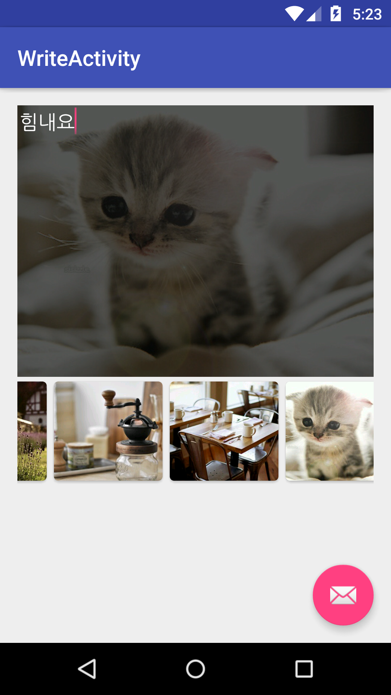


